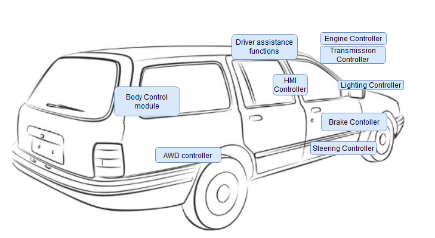
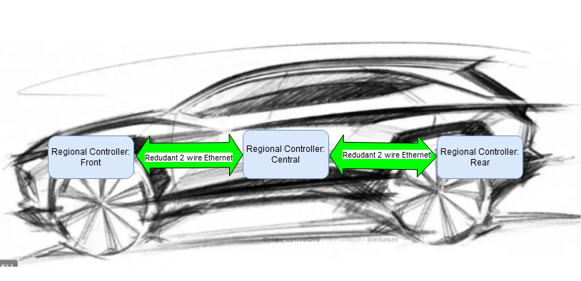
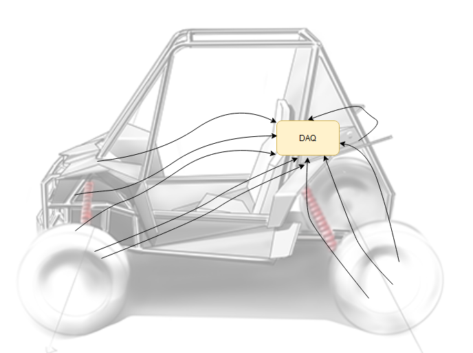
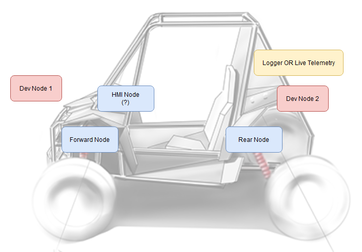
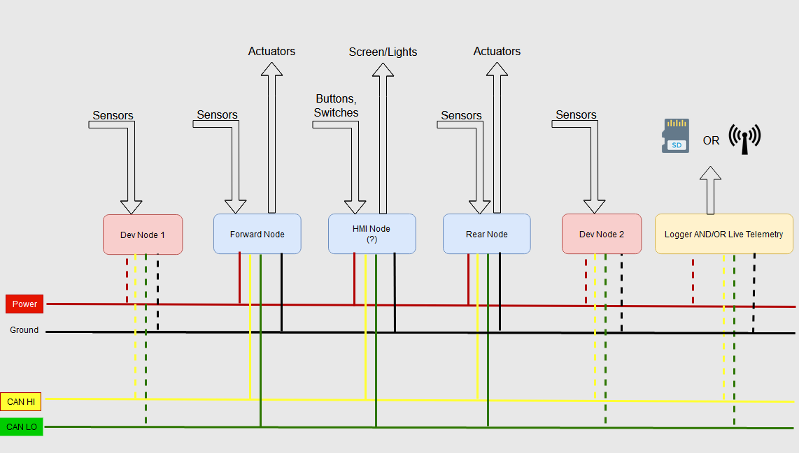

# Vehicle Networks & Data Acquisition

Since the 90's the automotive world has transistioned nearly every function that was once a direct wire connection to being operated via a local functional controller on a communication network.There are commercial, packaging and manufacturing drivers behind this but one of the most beneficial things was the ease of getting data on the state of the car from a single connection. The OnBoard Diagnostics (OBD) port that mechanics and dealers plug into the car is tapping into a communication network and makes solving issues significantly easier.<br>

In the Automotive OEM and supplier world, networks of this nature speed development as a log of the full vehicle state can be captured with an interface dongle for your particular protocol and a laptop. With some exceptions, CAN is tolerant of additional members and traffic on the network without issue. 

## CAN

CAN has been the dominant platform for vehicle communicaitons but there are also flavors such as FlexRay, LIN and now 2-wire Vehicle Ethernet for large bandwith functions. Due to the robustness, low cost and the ease of use CAN has found its way into stationary industrial devices and the entire transportation sector. If your career takes you toward development of large systems, it is extremely likely you will need to interact with a communication network either in capturing data or defining communications for controllers. Regardless of the communication protocol, the ideas around dealing with the network interface definitions are similar. <br>
[CAN FD](https://en.wikipedia.org/wiki/CAN_FD) was created to handle increased data rates and requirements for new vehicles but for the purposes of the baja vehicle the original CAN protocol is more than sufficient.

While a detailed explanation of the protocol can be provided here, [this link](https://www.csselectronics.com/pages/can-bus-simple-intro-tutorial) provides great insight very succintly and explains the network traffic and the ```.dbc``` file purpose. 

## Detour: Current and Future State of Automotive Electrical Architecture:

(Not required but marginally educational)

While the [link to CSS Electronics](https://www.csselectronics.com/pages/can-bus-simple-intro-tutorial) illustrates a single CAN network connecting the entire vehicle, the reality is much more complex. Most modern vehicles would easily saturate a modern CAN bus with every function on a single bus.
In many cases, there are some local networks for functions to segregate the lower level data that are required for some local functions but don't provide value to the greater vehicle network. Debugging one of those local networks then requires finding a connection point and attaching there.<br> <br>  Even things you don't seem to think would require CAN, use it. Think window switches, brake lights, throttle commands. Everything is a CAN message now vs voltage on a line.  In short, the image below would look like spaghetti between each of the blue boxes. From the blue boxes would be local networks to even more local devices. There would exist potentially a single network communicating some high level information required for inputs to different controllers. <br>



Now if you're thinking this is a lot of diverse hardware, you're right and the OEMS hate it. Many of these controllers are provided by a supplier who uses their own selection of chip and hardware package and have their own power requirements. Because of this, the industry is looking towards a concept called Software Defined Vehicle. The specifics different based on who you ask but the concept is to reduce the cost of developing software for these systems by simplifying this to a common computation system that is repeated in multiple places along the vehicle. Those platforms would then be purchased in larger numbers and more easily supported both in development and warranty. <br><br>



Instead of a controller existing for a specific function, a supplier would now provide containerized application code to run on dedicated core on one of these newly termed 'regional' controllers along side a safety rated microcontroller. The computation hardware in each region is the same but each location would be mated to an interface board that provides all the low level hardware required to take the place of the 6-8 controllers in the area. Each of these regional controllers is tied to a redundant vehicle ethernet bus with massive bandwidth to accomodate automated driving data and communication across regions. There would still be point to point connections as needed to local devices and generally CAN is still being used locally where it makes sense. Expect vehicles built with this to hit showrooms in the 2035 time frame.

Obviously for a Baja Vehicle, this is overkill. Just something to keep in mind. Times, they are a changin. 

(End Detour)


## Data Acquisition

Given that there are no electronics on the Baja vehicle it would seem that this seems like an overcomplication. However once the initial hurdles are passed, logging and adding sensors becomes significantly easier. You are also free of the input limitations, fixed sample rates and other proprietary roadblocks. The team has already done a cut of a home-grown data acquisition system, tackling some of the low level electronic issues. <br> Also given the low comparative cost of hardware prototyping in 2022, it seems silly to pay more to box yourself into a platform that doesn't provide any room for growth and would need to be removed from the vehicle for competition.

An off the shelf data acquisition setup with no network would look something like this: <br>
<br>
All wires tie into a central point. Seems simple enough. However, you have to pick that DAQ carefully and that DAQ device measures what it measures, nothing more. If you want to add more signals, you have to disconnect something. If you find a sensor that looks great but is incompatible, you have to do signal adaptation. Or you have buy another DAQ. Additionally wire runs become cumbersome and faulty. Additionally, without a truly expensive hardware, you have no means of looking at what's happening live, on OR off the car. 

Taking a hypothetical different approach, you'd have something like this (I didn't draw the can lines, I got lazy):<br>


Consider the blue nodes as the items you intend to run full time. Sensor signals run to node they are closest to and get dropped on the network at their specified sample rate. A logger, shown in yellow can be added to the network can be attached to the bus and log the full traffic. The two red development nodes may include specialized sesnors just for development logging and tuning. When the time comes, the sensors and the nodes are removed and unplugged from the vehicle.

From a wiring diagram standpoint, it might look like this with the dashed lines showing temporary connections as needed:



## Enabling Controls Development

You'll notice that the there are arrows going in and out of the blue nodes. For a first cut of the system, focus on getting the data in and analyzed but in future years, this will build the foundation for development of actively controlled systems on the car.  <br><br>
Dump some engine heat for 30 seconds while you're in lapped traffic with a button on the dash. <br> Have the pit monitor your TPMS and call you in if you don't notice the pressures falling on the dashboard display.<br>Consider how much easier tuning a CVT would be with a laptop vs weights and springs. <br>Perhaps you could pre-stage a CVT backshift approaching a hill to keep the engine revs high.<br>  Unlock a 4WD approaching a tight turn with a button and have it re-lock automatically when you straighten the wheel and the speed across it drops to zero.<br> Or forget crow-hop and steering issues due to 4WD when a clutched AWD system can be optimized for all conditions? 